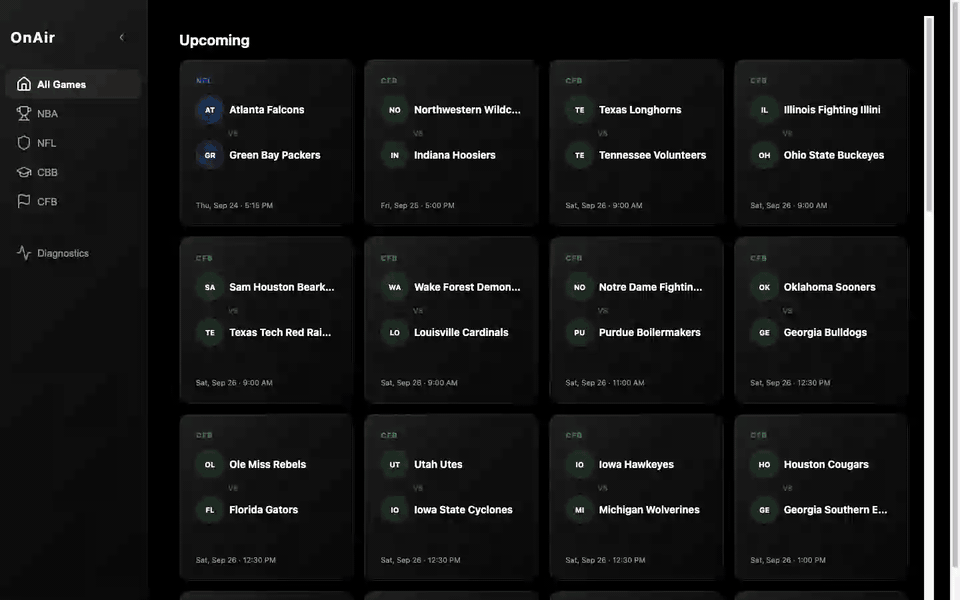

# OnAir

[](https://github.com/llukehanna/OnAir/actions/workflows/ci.yml)

A macOS desktop player that turns "click a game" into a live stream that stays up.

OnAir discovers games, collects candidate HLS streams from pluggable sources, probes and ranks them, and plays the best one.
When that stream stalls, errors, expires, or freezes, it fails over to the next candidate without the picture ever going black, and, when the streams carry timestamps, picks up at the same moment in the broadcast.



<sub>Recorded from the real app against its built-in fixture source: two local HLS streams that can be broken on command. [MP4](docs/media/demo.mp4)</sub>

## What makes it interesting

**Never black.** Two `<video>` elements, one visible and one staging.
A replacement stream loads out of sight and becomes visible on its first decoded frame.
The current picture is only torn down once something better is on screen.
A browser test tier runs a real decoder through the swap to prove it: the visible element never drops below `readyState 2`, and position only moves forward.

**Three detectors, because each failure hides from the other two.**
- A stall state machine catches a starved buffer.
- A fatal-error classifier tells an *expired CDN token*, which means re-fetching the URL and staying, apart from a *dead source*, which means moving on. The same 403 means different things before and after the first frame.
- An off-air check catches a stream that returns 200 on everything while its live edge has stopped moving. hls.js sees nothing wrong with that.

**An escalation ladder, not a retry loop.**
Next candidate, then one fresh extraction, then the source's own embedded player (verified by watching it play), then an honest "all sources failed" screen.
Concurrent triggers from renderer and main collapse into one switch.

**Continuity.** Sources run 45 to 100 seconds apart.
When streams carry `EXT-X-PROGRAM-DATE-TIME`, the replacement seeks to the same wall-clock instant before it's shown, so the viewer doesn't re-watch a play or skip one.

**Ranking that learns.** Candidates are scored on reliability history, stability, resolution parsed from the playlist, startup speed, and match confidence.
Every start, stall, and switch feeds back into the history.

More in [docs/FAILOVER.md](docs/FAILOVER.md) and [docs/ARCHITECTURE.md](docs/ARCHITECTURE.md).

## Stack

- **Electron 34** + **TypeScript** + **React 18** (electron-vite)
- **hls.js** for playback in the renderer
- **Playwright** headless Chromium, pooled at four pages, for sources that need a real browser
- **SQLite** via `better-sqlite3`
- **Jest** (run inside Electron's Node), GitHub Actions CI

## Sources

Sources plug in through one interface, `SourceAdapter.getCandidateStreams(game)`.
Everything downstream (matching, probing, ranking, playback, failover) is source-agnostic.

OnAir ships no third-party sources.
It includes a **fixture source**: a local HLS origin serving two streams with a sliding live window, which can be told to fail the way real sources do.
That's how the pipeline is developed, tested, and demoed.
[docs/ADAPTERS.md](docs/ADAPTERS.md) covers writing an adapter for streams you have access to.

Game schedules come from ESPN's public scoreboard endpoint.

## Running locally

Requires macOS and Node 22+.

```bash
npm install                 # also rebuilds better-sqlite3 for Electron
ONAIR_FIXTURE=1 npm run dev
```

Click any game.
The fixture source serves every game, so this works whether or not anything is live.
Then, from DevTools (⌥⌘I), break the stream and watch it recover:

```js
window.onair.fixtureSetMode('stall')         // stall → failover
window.onair.fixtureSetMode('segment-403')   // expired token → re-extract, stay on source
window.onair.fixtureSetMode('off-air')       // frozen live edge → failover
window.onair.fixtureSetMode('manifest-404')  // source gone → next candidate
```

The Diagnostics screen shows each switch as it happens.

Tests:

```bash
npm test                    # 527 unit + integration tests
npm run setup:browser       # one-time: Chromium for Playwright
npm run test:browser        # never-black invariant with a real decoder
npm run typecheck
npm run lint
```

Tests run inside Electron's Node, not the system Node.
`better-sqlite3` is a native module compiled for Electron's ABI, and rebuilding it for plain Node would fix the tests by breaking the app.

## Repo layout

```
src/main/        discovery, adapters + browser pool, stream engine, playback manager, SQLite
src/renderer/    React UI, dual-video playback hook, stall machine, error classifier, continuity
src/preload/     the window.onair bridge; the renderer never touches network, disk, or DB directly
tests/           unit + integration (Jest), browser tier, HLS fixture media
docs/            ARCHITECTURE, FAILOVER, ADAPTERS, IPC_API, DATABASE
```

## Things that went wrong

Some bugs taught more than the features they broke:

- **The test suite was testing itself.** 196 of 224 discovered test suites were stale copies inside abandoned git worktrees. Every green run before the fix was meaningless.
- **A 140 MB table for 255 rows.** Each game row stored the entire league's API payload, re-serialized every 60 seconds. Storing only each game's own event took the database from 147 MB to 147 KB.
- **"Plays fine, then dies for long periods."** Failover and manual source selection were stubs returning `not_implemented`, so nothing ever switched. The failure-handling layer was then designed around a written invariant rather than around adding more sources.
- **Concurrency drift.** The browser pool's limit had silently moved from 4 to 8, doubling peak memory and hiding a broken priority-queue guarantee.

## Status

- Works end to end against the fixture source: discovery, ranking, playback, failover across candidates and re-extraction, continuity, diagnostics. The embedded-player rung is covered by unit tests, since the fixture has no embed page
- 538 tests across 32 suites, plus 7 real-decoder browser tests
- macOS only; not packaged or signed for distribution
- Game tiles show ESPN logos, team colors, live score and clock, refreshed at the 60-second live poll

## License

[MIT](LICENSE)
